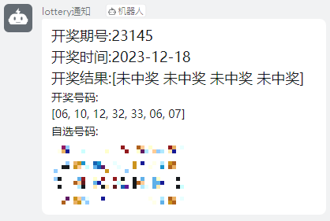

# EasyLottery

> 🚀定期通知大乐透中奖情况🚀开箱即用🚀


## Feature

1.
    - [x] 自由录入自选号码
2.
    - [x] 定期通知消息到钉钉机器人
3.
    - [x] docker一键启动，开箱即用


## Usage
config.ini文件中：
- 第一行填入钉钉机器人webhook
- 每个自选号占一行

```shell
docker pull winspain0/easy_lottery:latest
docker run -v /root/lotteryGo/config.ini:/app/lotteryGo/config.ini -itd winspain0/easy_lottery:latest
```


## Contributing

PRs accepted.

## License

MIT © Winspain

## Gitpod

https://gitpod.io/workspaces
